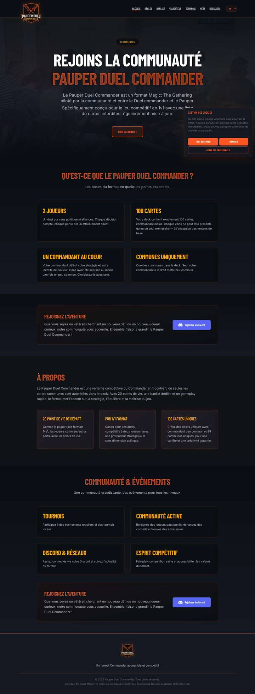

# Audit UX/UI — pauperduelcommander.fr

**Date** : 17 août 2026 · **Périmètre** : site public (FR/EN), desktop 1440 px et mobile 390 px · **Référence code** : `origin/main` @ `061d09a` (identique à la prod, 15 tournois) · **Méthode** : parcours réel de toutes les pages de la navigation + pages de détail, Lighthouse mobile (accessibilité, SEO, bonnes pratiques), trace de performance, mesures réseau, lecture du code (`site/src`, `site/content`, `site/public`).

Aucun code n'a été modifié. Ce document est le livrable « avant de coder ».

---

## 0. Résumé exécutif

Le site est **techniquement sain et déjà riche** : statique Astro, contenu structuré, données Scryfall, page Méta unique en son genre, historique de ban list, validateur. Mais il est construit comme une **brochure + documentation**, pas comme un **point d'entrée**. Cinq constats structurent l'audit :

1. **La homepage ne répond pas aux trois questions du nouveau venu** (c'est quoi ? pourquoi ? comment je commence ?). Le H1 dit « Rejoins la communauté », le sous-titre décrit le format « entre le Duel Commander et le Pauper » (ce qui suppose de connaître les deux), l'unique CTA — *Voir la banlist*, en style secondaire — est sous la ligne de flottaison, les mêmes quatre faits (2 joueurs, 100 cartes, général peu commun, communes) sont répétés dans trois sections, et **aucun contenu vivant** n'apparaît (aucun tournoi, aucune decklist, aucune date de ban list, aucune stat).
2. **Les boucles de valeur sont cassées.** Les 15 liens « Deck » du top 8 des tournois renvoient une **404** (`/fr/decklists/…` au lieu de `/fr/decklist/…`, [TournamentDetailPage.astro:107](../../../site/src/components/pages/TournamentDetailPage.astro)). Le footer ne contient **aucun lien** (ni navigation, ni Discord, ni confidentialité). Les quatre cartes « Communauté & événements » de la home ne pointent nulle part. Le Discord n'existe que sur la home.
3. **La ban list n'affiche ni sa date de mise à jour ni les noms en texte.** `lastUpdated` existe dans `banlist.json` mais n'est pas rendu ; les noms ne sont que dans les images (pas de recherche/Ctrl+F, page visuellement vide tant que Scryfall n'a pas répondu, ~1,5 Mo de scans sur mobile) ; une carte dont l'image manque disparaît purement et simplement (`card.imageUrl &&`).
4. **Mobile** : header fixe dont le logo déborde sur le contenu, index des decklists à **1 deck par écran** (11 000 px de scroll pour 25 decks), fiche decklist qui commence par **1 200 px d'images** avant le titre, aperçu de carte conçu pour le survol souris.
5. **Performance & SEO** : ~3,5 Mo d'images décoratives quasi invisibles (logo PNG de **888 Ko** affiché en 80 px, fonds de 0,9 à 1,75 Mo à 5–10 % d'opacité), pas de `canonical`/`hreflang`/Open Graph (aperçus Discord pauvres), Google Fonts + CDN tiers non épinglé (RGPD, `mana-font@latest`), cache HTTP de 15 minutes, `text-muted` sous le seuil de contraste (3,67:1).

**Le site en chiffres** (prod, 17/08/2026) : 15 tournois (oct. 2025 → août 2026, 6 villes), 25 decklists (10 avec auteur, 15 reliées à un top 8), 17 cartes bannies (6 comme général, 11 dans le deck), méta agrégée sur 9 tournois / 129 entrées, top 4 sur 11 tournois / 39 places, **4 tournois publiés sans résultats ni méta**, 2 annonces de ban list.

**Ce que ça change** : la refonte recommandée n'est **pas** graphique. C'est une re-hiérarchisation de la homepage autour de la proposition de valeur et d'un parcours « nouveau joueur », la remise en état des liens internes, et une remontée du contenu vivant (dates, résultats, méta) sur les pages d'entrée — le tout avec la stack, les composants et les données existants.

---

## 1. Comprendre le produit

### 1.1 Inventaire

| Page | Route FR | Contenu | Source de données |
|---|---|---|---|
| Accueil | `/fr/` | Hero, 3 sections « le format », 2 blocs Discord, « Communauté & événements » | i18n statique uniquement |
| Règles | `/fr/regles/` | Règlement officiel numéroté (1. Général, 2. Construction, 3. Règles de jeu) | `i18n/*.json` → `rulesDoc` |
| Banlist | `/fr/banlist/` | Grille « interdit comme commandant » (6), « interdit dans le deck » (11), historique (2 annonces) | `content/banlist.json`, `content/banlist-history/*.json`, Scryfall |
| Validateur | `/fr/validateur/` | Formulaire général/partenaire/decklist → API PHP, résumé des 6 règles | API `validate-deck.php` |
| Tournois | `/fr/tournois/` + `/fr/tournois/[slug]/` | Liste passés (15) ; détail : hero compact, top 8, méta du tournoi, camembert | `content/tournaments/*.json`, Scryfall |
| Méta | `/fr/meta/` | Généraux les plus joués (68), identités de couleur, répartition ; idem Top 4 (23) | agrégation de `tournaments/*.metaList` et `top8` |
| Decklists | `/fr/decklist/` + `/fr/decklist/[slug]/` | Grille filtrable (archétype, couleur) ; fiche : commandant, liste par type, stats, export | `content/decklists/*.json`, Scryfall |
| Confidentialité | `/fr/confidentialite/` | Politique | statique |
| 404 | `/404.html` | Bilingue | — |

Il n'y a **pas** de page Communauté, pas d'événements à venir (aucun tournoi futur en données → la section « Prochains tournois » n'est jamais rendue), pas de recherche, pas de comptes. Un chantier « formulaires de soumission » (decklists puis tournois → PR GitHub) est en cours sur `main` (`docs/plans/submission-forms/`, slices 1–3 livrées côté API).

### 1.2 Profils et parcours actuels

| Profil | Question | Où est la réponse aujourd'hui | Verdict |
|---|---|---|---|
| **Nouveau joueur Magic** | C'est quoi ce format ? | Hero : « entre le Duel Commander et le Pauper » ; 4 cartes de faits plus bas | Partiel — suppose de connaître DC et Pauper |
| | Est-ce que ça peut me plaire ? | Nulle part (aucun « pourquoi ») | ✘ |
| | Comment je commence ? | Nulle part (pas de parcours, règles = règlement juridique, pas de « premier deck ») | ✘ |
| **Joueur Pauper** | Différences avec le Pauper ? | Nulle part (pas de comparaison) | ✘ |
| | Quel commandant jouer ? | Méta (liste de 68) — non reliée aux decklists | Partiel |
| | Quels decks existent ? | Decklists (25), filtres archétype/couleur, pas de recherche | Partiel |
| **Joueur Duel Commander** | Qu'est-ce qui change ? | Nulle part | ✘ |
| | Niveau de puissance ? | Nulle part | ✘ |
| **Joueur PDC** | Banlist | Nav → 1 clic ✔ mais date de mise à jour invisible | Partiel |
| | Decklists | Nav → 1 clic ✔ | ✔ |
| | Méta | Nav → 1 clic ✔ | ✔ |
| | Résultats | Nav → Tournois → détail : 2 clics ✔ ; **decklists du top 8 : 404** | ✘ |
| | Événements à venir | Rien (section masquée quand vide) | ✘ |
| | Communauté / Discord | Home uniquement (pas dans header, footer, menu mobile) | Partiel |

### 1.3 Test des 5 secondes (homepage)

Ce qu'un visiteur voit au-dessus de la ligne de flottaison (1440×900) : badge « REJOINS-NOUS », H1 « REJOINS LA COMMUNAUTÉ / PAUPER DUEL COMMANDER », deux phrases, et le CTA coupé en bas d'écran (visible entièrement à 720 px de hauteur seulement grâce à un `py-32`). Sur mobile (390×844) : logo, badge, H1 sur 4 lignes, un paragraphe ; le CTA est hors écran.

- Magic ✔ (mot présent) · 1v1 ✔ (« 1v1 » dans la 2ᵉ phrase) · commandant ✘ (n'apparaît pas dans le hero) · communes ✘ (n'apparaît pas dans le hero) · pourquoi ✘.
- L'information existe plus bas (4 cartes), mais elle est **noyée** : elle est répétée trois fois (« Qu'est-ce que », « À propos », cartes « 20 PV / Pur 1v1 / 100 cartes uniques »), toujours en texte, jamais en visuel (aucune carte Magic, aucun chiffre mis en scène), et sans lien.

---

## A. Ce qui fonctionne (à conserver)

**Socle technique**
- Astro 5 statique, build enrichi par Scryfall avec cache 30 j et script de préchauffage (`scripts/warm-scryfall-cache.mjs`) ; aucune dépendance runtime hors PHP.
- i18n FR/EN complet (parité des clés vérifiée : 0 clé manquante), routes localisées centralisées (`lib/routes.ts`), sitemap avec hreflang, redirections 301 depuis les anciennes URL WordPress, 404 bilingue.
- Lighthouse mobile : SEO 100, bonnes pratiques 100, accessibilité 95 (home et détail tournoi), CLS 0, LCP < 400 ms en labo.
- Consentement cookies conforme (GA4 chargé après opt-in), page confidentialité.

**Identité visuelle**
- Univers reconnaissable : fond sombre, orange `#FF5722` + or, Barlow Condensed (titres) / Inter (texte) / Beleren (noms de cartes), pips de mana `mana-font`, composant `magic-card`, badges — ça dit « Magic + compétition ». À garder tel quel.
- Les cartes Magic servent déjà l'information : art crops dans la méta/decklists/top 8, scans dans la ban list, aperçu au survol.

**Fonctionnalités différenciantes**
- **Méta** : agrégation réelle (généraux, identités, couleurs ; global + top 4), taille d'échantillon affichée (« 9 tournois — 129 entrées »), généraux bannis signalés, aperçu au survol.
- **Détail tournoi** : hero compact (le seul du site), podium, badge « Deck », méta du tournoi avec camembert, données de méta par tournoi.
- **Fiche decklist** : liste groupée par type avec coûts de mana, courbe, répartitions couleurs/types, export presse-papiers, commandant banni signalé (bandeau + grisé).
- **Ban list** : séparation commandant / deck, **historique des annonces** (timeline, mention « expérimental », justifications dépliables, cadence des annonces).
- **Règles** : règlement officiel numéroté, ancres, références externes.
- **Validateur** : outil unique pour le format, garde-fous d'abus, et un résumé « Règles du format PDC » en 6 cartes qui est exactement le « règles en 30 secondes » qui manque à la page Règles.

**Contenu et organisation**
- 15 tournois saisis avec top 8, méta et 15 decklists reliées (relation `top8[].decklistSlug` déjà présente).
- Historique de ban list bilingue avec justifications.
- Le plan « soumission de decklists/tournois » en cours adresse le vrai goulot (publication manuelle) — l'audit s'y appuie plutôt que de le dupliquer.

---

## B. Problèmes UX

Classement : **Critique** (bloque un parcours ou trompe l'utilisateur) · **Important** (friction forte, objectif atteint difficilement) · **Mineur** (polish).

### Critiques

| # | Problème | Preuve | Impact |
|---|---|---|---|
| UX-01 | **Liens « Deck » du top 8 → 404.** L'URL est construite `/${locale}/decklists/${slug}/` alors que la route est `/decklist/`. | [TournamentDetailPage.astro:107](../../../site/src/components/pages/TournamentDetailPage.astro) ; testé sur `/fr/tournois/animmagic-3/` : 4/4 liens en 404 ; 15 liens concernés sur le site | Casse la boucle *événement → résultats → decklists*, la plus forte du site ; nuit à la crédibilité |
| UX-02 | **Homepage sans proposition de valeur ni parcours.** H1 « Rejoins la communauté » ; description « entre le Duel Commander et le Pauper » ; un seul CTA (secondaire) sous la ligne de flottaison ; faits répétés 3× ; zéro contenu dynamique ; blocs Discord dupliqués. | [HomePage.astro](../../../site/src/components/pages/HomePage.astro) ; capture 01 | Le nouveau visiteur ne sait ni pourquoi jouer ni par où commencer ; le joueur existant ne trouve rien d'actualisé |
| UX-03 | **Ban list : date de mise à jour absente, noms uniquement en image, cartes récentes non signalées.** `lastUpdated: "2026-08-03"` n'est pas rendu ; la grille n'affiche que des `` (overlay au survol seulement) ; si `imageUrl` est nul la carte n'est pas rendue du tout. | [BanlistPage.astro](../../../site/src/components/pages/BanlistPage.astro), [BanListGrid.astro:26](../../../site/src/components/BanListGrid.astro) | Un joueur en tournoi ne peut ni vérifier la fraîcheur, ni chercher un nom, ni voir ce qui a changé ; risque d'omission silencieuse d'une carte bannie |
| UX-04 | **Fiche decklist illisible sur mobile.** 1 200 px d'images (général + partenaire en pleine largeur) avant le titre ; 99 cartes en une colonne (page de 12 700 px) ; pas de sommaire ; l'aperçu de carte se déclenche « par accident » au tap et n'a pas de fermeture. | captures 07 et 14 | Cas d'usage n° 1 en tournoi (« montrer/consulter une liste ») dégradé |
| UX-05 | **Communauté introuvable hors homepage ; footer sans lien.** Discord absent du header, du menu mobile, du footer ; footer = logo + slogan + mentions ; page confidentialité reliée nulle part (hors modale cookies). | [Header.astro](../../../site/src/components/Header.astro), [Footer.astro](../../../site/src/components/Footer.astro) | « Où sont les joueurs ? » sans réponse depuis 90 % des pages ; obligation légale d'accès à la politique de confidentialité fragile |

### Importants

| # | Problème | Preuve | Impact |
|---|---|---|---|
| UX-06 | **Index decklists : titre « Quelques decklists », intro « collection en construction »** ; cartes sans date, auteur, résultat ni tournoi → 4 cartes « Gut, True Soul Zealot » indiscernables ; pas de recherche par commandant, ni tri, ni compteur ; 1 deck par écran sur mobile | capture 04, 05 ; `archive.decklistTitle/Desc` dans `fr.json` | Dévalorise le contenu ; « je veux jouer, qu'est-ce que je construis ? » sans réponse |
| UX-07 | **Fiche decklist appauvrie** : auteur jamais affiché (10 listes en ont un), pas de lien vers le tournoi ni le classement (pourtant encodés dans le titre « (1er) »), pas de fil d'Ariane, pas de « autres decks de ce commandant », export = presse-papiers uniquement, pas de lien « valider ce deck » | [DecklistDetailPage.astro](../../../site/src/components/pages/DecklistDetailPage.astro) | Pas de circulation decklist ↔ tournoi ↔ méta |
| UX-08 | **Méta trop longue et isolée** : 68 généraux listés dont 39 à une seule entrée (page de 7 500 px), pas de repli ; pas de période analysée ni date de mise à jour ; aucun lien général → decklists/tournois ; pas de tendance | capture 08 | Sous-exploitée alors que c'est l'atout n° 1 ; le lecteur ne sait pas « depuis quand » |
| UX-09 | **Tournois : pas de « à venir », pas d'état** : la section n'existe que s'il y a un futur (aujourd'hui vide, sans message) ; 4 tournois sans résultats sont indiscernables des autres ; aucune info vainqueur sur la liste ; pas de filtre région/organisateur ; pas d'appel « organiser / soumettre » | capture 10 ; `TournamentsIndexPage.astro` | Le site paraît inactif ; on ne sait pas où jouer ce mois-ci |
| UX-10 | **Règles = document juridique sans résumé** : hero plein écran, puis 3 sections numérotées ; pas de « règles en 30 s » ; règle 2.7 (ban list) sans lien ; pas de FAQ (partenaires/backgrounds, rareté Arena, cartes non légales en Vintage) | capture 11 | Le débutant décroche ; le joueur confirmé cherche un cas particulier sans le trouver |
| UX-11 | **Navigation par structure, pas par intention** : ordre Accueil · Règles · Banlist · Validateur · Tournois · Méta · Decklists ; pas de Communauté ; sélecteur de langue en `<select onchange>` (non crawlable, surprenant au clavier) | [Header.astro:11-19](../../../site/src/components/Header.astro) | Validateur avant Decklists ; Discord/communauté invisible |
| UX-12 | **Heros plein écran sur Règles et Banlist** (`py-32`, H1 8xl) : le contenu utile commence à ~900 px desktop et après deux écrans mobile | captures 03, 11 | Coût d'accès élevé aux deux pages les plus consultées en partie |
| UX-13 | **Aucune comparaison de formats, aucun « pourquoi », aucune notion de niveau/coût** | tout le site | Les joueurs Pauper/DC — la cible la plus facile à convertir — n'ont pas d'argument |
| UX-14 | **Aucun contenu « pour commencer »** : pas de deck recommandé, pas de guide, pas de « pré-requis » (où acheter, combien de cartes à trouver) | — | Le parcours d'onboarding s'arrête aux règles |

### Mineurs

| # | Problème | Preuve |
|---|---|---|
| UX-15 | Redirection racine `/` → `https://pauperduelcommander.fr:443/fr/` (port explicite dans `Location`) ; `www.` non redirigé vers l'apex (contenu dupliqué) | `curl -I` |
| UX-16 | Aperçu au survol : pas de lien Scryfall, se déclenche au tap sans bouton fermer, image `normal` 488×680 chargée pour chaque survol | `card-hover.ts` |
| UX-17 | Titres SEO faibles (« Banlist — », « Quelques Decklists — », « Méta PDC — ») ; pas de meta description sur la ban list | `<title>` mesurés |
| UX-18 | Validateur : messages d'erreur en français sur la version EN ; aucun lien depuis les fiches decklist | CLAUDE.md, `DecklistDetailPage.astro` |
| UX-19 | Menu mobile : pas d'état actif, pas de Discord, pas d'`aria-expanded`, pas de piège de focus | `Header.astro`, `mobile-menu.ts` |
| UX-20 | Bannière cookies : masque le CTA du hero à droite sur desktop et occupe le bas d'écran mobile tant qu'on n'a pas répondu | capture 01 |
| UX-21 | « Places » non traduit (`{tournament.playerCount} places` en dur) dans `TournamentsIndexPage.astro:81` | code |
| UX-22 | Le sitemap déclare `/fr/` et `/en/` mais aucune balise `hreflang`/`canonical` dans le `<head>` ; pas d'Open Graph → aperçus de liens Discord/Twitter sans image ni description | `<head>` mesuré sur 6 pages |

---

## C. Problèmes UI

**Hiérarchie**
- Tout crie : H1 en 5xl→8xl (jusqu'à 128 px) avec dégradé animé (`text-magic-gradient` + `shimmer` en boucle) et ombre portée, H2 de section en 4xl/5xl également en dégradé animé, badges pilule au-dessus de chaque H1, sections toutes centrées. Résultat : rien ne ressort, l'œil n'a pas de point d'entrée.
- Trois niveaux de « cartes » visuellement identiques (`glass-effect border rounded-xl p-8`) sur la home, sans icône ni lien : on ne distingue pas un fait, une valeur et une action.
- Le logo (h-36 = 144 px desktop, 80 px mobile) est positionné en absolu et déborde du header, il chevauche le début des heros ; le header fixe mesure ~104 px desktop (logo 144 px) et ~65 px mobile (logo 80 px).

**Couleurs et contraste**
- `--color-text-muted: #6B7280` sur `#141821` = **3,67:1** (Lighthouse : échec `color-contrast` sur la home et le détail tournoi). Utilisé pour le footer, les noms de joueurs (12 px), les dates. `text-secondary/60` = 4,22:1. Cible ≥ 4,5:1 → `#8B93A1` (4,9:1) ou `#9AA1AD`.
- Texte en dégradé (`background-clip: text`) sur tous les titres : lisibilité réduite sur fond de photo, `text-shadow` sans effet sur du texte transparent.

**Typographie**
- Quatre familles chargées (Barlow Condensed 6 graisses, Inter 5 graisses, Beleren, mana-font) via 3 origines (Google Fonts, jsdelivr, local) ; graisses inutiles (300, 500, 800, 900).
- Tailles fixes en `style="font-size:10px"` pour les partenaires (méta, top 8) ; hack `!important` de `line-height` sur les grands titres.
- Le condensé Barlow en capitales pour tous les titres est cohérent avec l'univers, à garder ; c'est la taille et l'animation qui posent problème, pas la police.

**Composants**
- `.btn-primary` : dégradé animé en permanence + `scale(1.05)` au survol ; `.btn-secondary` utilisé pour l'unique CTA du hero → pas de hiérarchie d'action.
- `.magic-card` : `::before/::after` + bordure orange à 20 % sur **tous** les conteneurs (règles, tournois, validateur) → l'orange perd sa fonction d'accent.
- Deux blocs Discord identiques sur la home ; quatre cartes « Communauté & événements » sans action.
- Barres de progression de la méta masquées sous `sm`, chiffres à 10–12 px sur mobile.

**Espacements et rythme**
- `py-32` sur les heros, `py-24` sur les sections, `mb-16` avant les grilles : rythme de landing marketing appliqué à un site outil (ban list, règles).
- Sections vides ou creuses : Tournois = un titre + une liste ; Méta = deux blocs de 3 500 px.

**Responsive**
- Pas de débordement horizontal constaté (390 px). Mais : index decklists en une colonne d'images 4:3 pleine largeur (~800 px par deck), fiche decklist en une colonne, filtres empilés qui repoussent le contenu à 600 px, header fixe de 65 px avec logo débordant.
- Images sans `width`/`height` (0 sur 6 pages), `loading="lazy"` sur tout y compris les visuels du premier écran, aucun `srcset` ; vignettes de 44–56 px alimentées par des `art_crop` 626 px (acceptable) et l'aperçu par des `normal` 488×680.

**Iconographie / motion**
- Heroicons inline cohérents ; `.section-divider` avec « ⚔ » défini mais inutilisé (`globals.css`).
- Animations permanentes (`animate-float` sur les halos, `shimmer` sur titres et bouton primaire) sans `prefers-reduced-motion`.

---

## D. Quick wins

Réalisables en moins d'une journée chacun, avec les composants et données existants. Numérotation reprise dans le backlog (F).

| # | Quick win | Fichiers |
|---|---|---|
| QW-1 | **Corriger l'URL des decks du top 8** : remplacer la chaîne par `route('decklists', locale, t8.decklistSlug)` (une ligne). | `TournamentDetailPage.astro:107` |
| QW-2 | **Ban list** : badge « Mise à jour le 3 août 2026 » sous le H1 (dérivé de `lastUpdated`, ou de la dernière entrée `banlist-history`) + compteur (« 17 cartes ») ; nom de la carte **sous** chaque image (Beleren, 14 px) ; étiquette « Nouveau » sur les cartes bannies lors de la dernière annonce ; encart « Dernière annonce » (résumé + lien historique) en tête ; fallback texte quand l'image manque. | `BanlistPage.astro`, `BanListGrid.astro`, `fr.json`/`en.json` |
| QW-3 | **Footer utile** : 3 colonnes (Format : Règles, Banlist, Validateur · Jouer : Decklists, Méta, Tournois · Communauté : Discord, Confidentialité, contact/Discord du comité) + mention « annonces tous les deux mois ». | `Footer.astro` |
| QW-4 | **Discord dans le header** (icône + libellé sur desktop, entrée dans le menu mobile). | `Header.astro` |
| QW-5 | **Hero home** : réécrire H1/sous-titre (voir E.1), un CTA primaire + deux secondaires, retirer le badge « Rejoins-nous », faire tenir le CTA au-dessus de la ligne de flottaison (`py-20` max, H1 6xl/7xl). Supprimer la section « À propos » (redondante), transformer les 4 cartes « Communauté & événements » en liens (Tournois, Méta, Decklists, Discord), garder **un** seul bloc Discord. | `HomePage.astro`, i18n |
| QW-6 | **Images** : logo → SVG (ou WebP 2× ≈ 20 Ko) ; fonds `hero-background.jpg` (899 Ko), `artefacts.jpg` (985 Ko), `cards-background.png` (1,75 Mo) → WebP ≤ 100 Ko à la bonne taille, ou dégradé CSS ; `width`/`height` sur les images de cartes ; `loading="eager"` + `fetchpriority="high"` sur le visuel LCP, `lazy` ailleurs. Gain ≈ **3,3 Mo** par première visite. | `public/img/*`, `Header.astro`, `Footer.astro`, pages |
| QW-7 | **Contraste** : `--color-text-muted` → `#8B93A1` ; remplacer `text-secondary/60` par `/80`. | `globals.css`, `MetaPage.astro`, `Top8Table.astro` |
| QW-8 | **`<head>` SEO/partage** : `canonical`, `hreflang` fr/en/x-default (via `translatePath`), Open Graph + Twitter card (image = art du commandant sur decklist/tournoi, logo ailleurs), meta description sur la ban list, titres enrichis (« Banlist Pauper Duel Commander — mise à jour août 2026 »). | `Base.astro` (props `image`, `canonical`), pages |
| QW-9 | **Index decklists** : titre « Decklists » + sous-titre factuel (« 25 decklists, dont 15 issues de top 8 ») ; sur chaque carte : date, résultat + tournoi (« 1er · Anim'Magic #3 », via `tournaments.top8`), auteur ; compteur de résultats ; champ de recherche par commandant (le filtre client existe déjà) ; tri date/commandant ; disposition « liste compacte » sous `sm`. | `DecklistIndexPage.astro`, nouveau `lib/decklists.ts` |
| QW-10 | **Fiche decklist** : afficher l'auteur ; encart « Résultat : 1er · Anim'Magic #3 · 19 juil. 2026 » avec lien ; fil d'Ariane ; « Autres decks avec ce commandant » (même `commander`) ; bouton « Valider ce deck » (pré-remplissage du validateur via `?commander=&decklist=` ou `sessionStorage`) ; sur mobile, titre et méta **avant** les images de carte. | `DecklistDetailPage.astro`, `ValidatorPage.astro` |
| QW-11 | **Méta** : replier après le top 15 (« Voir les 53 autres généraux », `
` sans JS) ; afficher la période (« du 13 oct. 2025 au 15 août 2026 ») et « mise à jour à chaque tournoi publié » ; lier chaque général à `/fr/decklist/?commander=…` et à ses résultats. | `MetaPage.astro` |
| QW-12 | **Tournois** : état vide « Aucun tournoi annoncé pour l'instant — rejoignez le Discord pour être prévenu / organisateurs : proposez le vôtre » ; badge « Résultats » vs « Résultats à venir » ; vainqueur + général sur chaque ligne ; grouper par année ou afficher un filtre par ville. | `TournamentsIndexPage.astro`, i18n |
| QW-13 | **Règles** : bloc « Les règles en 30 secondes » au-dessus du règlement (réutiliser les 6 cartes du validateur en composant `RulesSummary.astro`), lien ban list dans la règle 2.7, sommaire ancré, hero réduit. | `RulesPage.astro`, `ValidatorPage.astro` |
| QW-14 | **HTTP** : `Cache-Control: max-age=31536000, immutable` sur `/_astro/*`, 30 j sur `/img/*` et `/fonts/*` ; redirection `www.` → apex ; `RedirectMatch` avec URL absolue pour supprimer `:443`. | `public/.htaccess` |
| QW-15 | **Polices** : auto-héberger Barlow Condensed (400/700) et Inter (400/600) en woff2 avec `font-display: swap`, épingler et localiser `mana-font` (supprimer `@latest`), `preload` du woff2 des titres. RGPD (Google Fonts) + 2 origines tierces en moins. | `globals.css`, `Base.astro`, `public/fonts` |
| QW-16 | **`prefers-reduced-motion`** : désactiver `shimmer`, `float`, `scale` au survol. | `globals.css` |

---

## E. Refonte recommandée

### E.1 Proposition de valeur

Formulation proposée (courte, vérifiable dans les règles et les données du site) :

> **Le Commander compétitif en 1v1, avec des communes.**
> 100 cartes, un général peu commun, 20 points de vie : la profondeur du Commander, l'accessibilité du Pauper.

Arguments différenciants — chacun adossé à une règle ou à une donnée, à afficher tels quels (aucun chiffre non sourcé) :

1. **Un vrai duel** : 1 contre 1, 20 PV, pas de politique ni de blessures de général (règles 1.1, 3.1, 3.4).
2. **Accessible** : 99 cartes communes + 1 peu commune (règles 2.4, 2.6). Ne pas afficher de prix chiffré tant que l'équipe n'a pas de source ; « le prix d'un deck Pauper » est un ordre de grandeur, à valider avec la communauté avant publication.
3. **N'importe quelle créature peu commune peut être général** — pas besoin de légendaire (règle 2.4). C'est la différence la plus originale avec le Duel Commander : des milliers de généraux possibles. Preuve interne : **68 généraux distincts sur 129 entrées (39 n'ont été joués qu'une fois), le n° 1 à 9 %** — une méta ouverte.
4. **Singleton 100 cartes** : deckbuilding créatif, cartes oubliées remises en jeu (règle 2.2).
5. **Un format vivant, piloté par la communauté** : 15 tournois depuis octobre 2025 dans 6 villes (Bordeaux, Lille, Metz, Toulon, Hyères, Marcq-en-Barœul), un comité, des annonces tous les deux mois, une ban list qui évolue avec justifications publiques.

### E.2 Hero et CTA

- **Sur-titre** : « Format communautaire · Magic: The Gathering · 1 contre 1 »
- **H1** : « Pauper Duel Commander » (le nom, seul, en 6xl/7xl — pas « Rejoins la communauté »)
- **Sous-titre** : la proposition de valeur (2 lignes max)
- **CTA primaire : « Découvrir le format »** → ancre vers le parcours « Nouveau ici ? » (ou page `/fr/decouvrir/` si on préfère une URL SEO). C'est le seul CTA qui répond au visiteur qui ne sait pas encore ce que c'est ; les joueurs existants n'utilisent pas le hero, ils utilisent la nav.
- **CTA secondaires** : « Voir les decklists » (répond aux joueurs Pauper/DC : « quel deck ? ») et « Rejoindre le Discord » (icône Discord, style secondaire).
- Écartés comme primaire : « Construire mon premier deck » (rien ne l'étaye aujourd'hui — pas de guide, pas de catégorie « pour commencer » ; à reconsidérer en P1 quand elles existeront) ; « Voir la banlist » (accès quotidien, sa place est dans le bandeau d'accès rapide et la nav) ; « Rejoindre la communauté » (ne dit pas ce qu'est le format).
- **Visuel** : remplacer la photo à 5 % d'opacité par un vrai visuel qui *montre* le format : 2–3 cartes de généraux emblématiques (art crops déjà disponibles via Scryfall au build : par ex. les 3 généraux les plus joués de la méta, mis à jour automatiquement) ou une photo de tournoi lisible. Une carte vaut mieux qu'un fond flou.

### E.3 Parcours « Nouveau ici ? »

Section immédiatement sous le bandeau d'accès rapide, quatre étapes horizontales (colonne sur mobile), chaque étape = un verbe, deux lignes, un lien :

1. **Comprendre les règles** — 100 cartes, un général peu commun, 20 PV, communes uniquement → *Les règles en 30 secondes* (`/fr/regles/#essentiel`)
2. **Choisir un général** — n'importe quelle créature peu commune, ou un Véhicule/Vaisseau/Background → *Les généraux les plus joués* (`/fr/meta/`) et *Le validateur pour vérifier une idée*
3. **Construire son deck** — partir d'une liste qui a fait ses preuves → *Decklists « pour commencer »* (`/fr/decklist/?tag=debutant`, voir E.6) puis *Valider mon deck*
4. **Trouver des joueurs** — Discord, tournois près de chez soi → *Rejoindre le Discord*, *Voir les tournois*

L'ordre est réel (c'est bien une séquence), la numérotation est donc légitime.

### E.4 Comparaison des formats

Données vérifiées le 17/08/2026 (règles PDC = `rulesDoc`, Duel Commander = duelcommander.org/rules/quickrules, Pauper = règles WotC). À faire relire par le comité avant publication.

| | Pauper | Duel Commander | **Pauper Duel Commander** |
|---|---|---|---|
| Joueurs | 1 contre 1 | 1 contre 1 | 1 contre 1 |
| Deck | 60 cartes minimum + réserve de 15 | 100 cartes exactement, général inclus | 100 cartes exactement, général(aux) inclus |
| Exemplaires | jusqu'à 4 par carte | Singleton (sauf terrains de base) | Singleton (sauf terrains de base) |
| Commandant | Aucun | Créature légendaire, planeswalker « peut être votre commandant », Véhicule/Vaisseau légendaire, Background ; toutes raretés | Créature, Véhicule, Vaisseau ou Background **imprimé en peu commune** — pas besoin d'être légendaire |
| Rareté | Communes uniquement | Aucune restriction | 99 communes + général peu commun |
| Points de vie | 20 | 20 | 20 |
| Blessures de général (21) | — | Non | Non (règle 3.4) |
| Mulligan | Londres | Londres | Londres |
| Ban list | Pauper Format Panel | Comité Duel Commander, ban list dédiée | Comité PDC France (bannies comme commandant / dans le deck), annonces tous les deux mois |

Placement : sur la home (version compacte 5 lignes + lien) et en tête de la page Règles (version complète). Ne pas inventer une ligne « coût » ou « niveau de puissance » : à formuler qualitativement (« pool Pauper : pas de fetchlands, pas de tuteurs rares, jeu plus interactif ») uniquement si le comité valide la phrase.

### E.5 Structure cible de la homepage

Ordre et contenu ; tout ce qui est « vivant » se calcule au build à partir des collections existantes (aucun runtime).

1. **Hero** — quoi / pourquoi / CTA (E.2).
2. **Bandeau d'accès rapide** (une ligne de 4 tuiles, texte + chiffre) : *Banlist — mise à jour le 3 août* · *Prochain tournoi — [date, ville]* (ou « aucun annoncé — proposer le vôtre ») · *Dernier résultat — Life is a Game #1 : [vainqueur, général]* · *Méta — 9 tournois, 129 entrées*. C'est la porte des joueurs existants.
3. **Nouveau ici ?** — les 4 étapes (E.3).
4. **Le format en 4 chiffres** — 2 joueurs · 100 cartes · 1 général peu commun · 20 PV, sur une ligne, avec une carte Magic pour illustrer « peu commun » vs « commune » (remplace les trois sections redondantes).
5. **Comparaison Pauper / DC / PDC** — version compacte (E.4) + lien Règles.
6. **La méta en ce moment** — top 5 généraux (vignettes art crop, %), 3 identités dominantes, mention « 9 tournois · 129 entrées · maj 15 août » → lien Méta.
7. **Résultats récents & prochains tournois** — 3 derniers (titre, date, ville, vainqueur + général, lien) ; à venir (ou état vide avec CTA Discord/organiser) → lien Tournois.
8. **Decklists à découvrir** — 6 cartes : 3 récentes + 3 performantes (top 8), avec date/résultat/couleurs → lien Decklists.
9. **Communauté** — un seul bloc : Discord (CTA), « Où jouer ? » (liste des organisateurs/villes dérivée des tournois), « Proposer une decklist / un tournoi » (branché sur les formulaires en cours).
10. **Footer complet** (QW-3).

Le ton passe de « site institutionnel » à « format vivant » sans changer la charte : ce sont les données qui font l'effet, pas la déco.

### E.6 Pages principales — cibles

**Règles** — trois strates : (1) *Les règles en 30 secondes* : 6 cartes (réutiliser celles du validateur) + la comparaison ; (2) *Règlement officiel* (existant), avec sommaire ancré sticky sur desktop et hero réduit ; (3) *Cas particuliers / FAQ* : partenaires & backgrounds (2.5), raretés (1.4 : Arena ignoré, cf. commit `c3d0174`), cartes non légales en Vintage (2.8), mulligan, joueur qui commence (3.3), « ma carte est-elle légale ? → validateur ». Liens sortants : ban list (2.7), validateur, decklists.

**Banlist** — header compact avec **date de mise à jour**, compteur, champ de recherche (filtre client sur les noms, ils sont dans le DOM), encart « Dernière annonce : 3 août 2026 — Treasure Cruise bannie ; 4 « Loyal » légalisées à titre expérimental » (dérivé de `banlist-history`) ; grilles avec nom sous l'image et étiquette « Nouveau » ; historique (existant) ; lien vers les règles 2.7/2.8 et vers le validateur. Sur mobile : 3 colonnes de vignettes + nom, plutôt que 2 scans pleine largeur.

**Decklists (index)** — header compact ; filtres : recherche commandant, couleur, archétype, « issues de tournois », tri (récent / résultat / commandant) ; puis des **rayons** avant la grille complète :
- 🔥 *Les decks du moment* — top 8 des 3 derniers tournois (données existantes)
- 🏆 *Decks performants* — 1ʳᵉ–2ᵉ places (données existantes)
- 🆕 *Nouveaux decks* — 6 dernières dates
- 🧪 *Decks originaux* — généraux à 1 entrée dans la méta (données existantes)
- 👶 *Pour commencer* — nécessite un **nouveau champ éditorial** `tags: ["debutant"]` (ou `beginner: true`) dans `content/decklists/*.json` + schéma zod ; à sélectionner par l'équipe (3–5 listes mono/bicolores, budget, gameplan simple).
Cartes enrichies : commandant (art), couleurs, archétype, **date, auteur, résultat + tournoi**, partenaire. Mode liste compact sous `sm`. Compteur de résultats. CTA discret « Proposer une decklist » (conforme au plan de soumission).

**Fiche decklist** — en-tête mobile-first : titre, général + partenaire (vignettes cliquables → aperçu), couleurs, archétype, auteur, date, **résultat/tournoi**, actions (Copier · Télécharger .txt · Ouvrir dans Moxfield/Archidekt · Valider ce deck) ; sommaire par type (ancres) ; liste 2 colonnes dès 360 px (Beleren 14 px) ; aperçu de carte au tap avec fermeture (et lien Scryfall) ; stats (existant) ; « Autres decks avec ce général » ; fil d'Ariane ; Open Graph avec l'art du général.

**Méta** — bandeau d'échantillon en tête (« 9 tournois · 129 entrées · du 13 oct. 2025 au 15 août 2026 · mise à jour à chaque tournoi publié ») ; top 15 + repli ; identités et couleurs (existant, en graphes) ; **tendance** : comparer les 3 derniers tournois vs le reste (variation en points) — calculable au build ; chaque général → decklists filtrées + tournois où il a fait top 4 ; lien vers la ban list quand un général listé est banni.

**Tournois** — deux onglets/sections : *À venir* (avec état vide et CTA) et *Résultats* ; sur chaque ligne : date, ville, joueurs, badge résultats, vainqueur + général (vignette) ; filtre ville/organisateur ; détail : existant + decklists reliées (QW-1) + « Méta du tournoi » (existant) + lien retour + Open Graph ; CTA organisateurs « Soumettre un tournoi » (plan en cours). Chaque événement alimente la boucle *événement → résultats → stats → decklists*.

**Communauté** — nouvelle page `/fr/communaute/` (ou section de la home si on veut limiter la nav) : « Trouve des joueurs » : Discord (CTA principal, description « discutez, partagez vos decks, trouvez des adversaires »), Événements (à venir + derniers), **Où jouer ?** (liste des lieux/organisateurs dérivée de `tournaments.location/city`, avec nombre de tournois : Artefact Bordeaux ×6, Anim'Magic Wattrelos ×3, Ludotrotter Metz ×2, Fight Club Toulon ×2, Chupacabras Hyères, Life is a Game Marcq), « Organiser un tournoi » (contact/Discord + futur formulaire), le comité et la cadence des annonces.

### E.7 Navigation cible

`[Logo → accueil] Règles · Banlist · Decklists · Méta · Tournois · Communauté · Validateur | [Discord] [FR/EN]`

- « Accueil » sort de la liste (le logo suffit ; libère de la place).
- Ordre = intentions : *apprendre* (Règles, Banlist), *jouer* (Decklists, Méta, Tournois), *rejoindre* (Communauté), *outil* (Validateur, en dernier ; aussi lié depuis Règles, Decklists et fiches).
- Discord = icône persistante à droite (desktop) et première entrée du menu mobile.
- Sélecteur de langue : deux liens `<a hreflang>` FR/EN (crawlables) plutôt qu'un `<select onchange>`.
- Recherche : pas de moteur global à ce stade (site de ~60 pages) ; une recherche **par page** suffit (ban list, decklists, méta). Réévaluer si le nombre de decklists dépasse ~100.

### E.8 Mobile (audit spécifique)

Contexte : consultation en tournoi, téléphone posé à côté du tapis.

| Tâche | Aujourd'hui | Cible |
|---|---|---|
| Consulter la ban list | 2 écrans de hero, scans pleine largeur, pas de recherche, date invisible | Date + recherche dès le premier écran, vignettes 3 col. + noms |
| Chercher une carte | Impossible (noms en image) | Champ de recherche + Ctrl+F sur noms texte |
| Consulter une decklist | 1 200 px d'images, 12 700 px de page, aperçu accidentel | Titre d'abord, liste 2 col., sommaire, aperçu au tap fermable |
| Vérifier une règle | Hero + 3 blocs | « 30 secondes » en tête, ancres, sommaire |
| Voir les résultats | Liste OK, decks 404 | Vainqueur sur la liste, decks reliés |
| Header | ~65 px fixes + logo de 80 px qui déborde | ≤ 56 px, logo contenu dans la barre, ou header qui se masque au scroll |
| Filtres decklists | 2 selects empilés (200 px) | Barre compacte + « Filtres » repliable |
| Boutons | OK (≥ 44 px) | idem |
| Texte | 10–12 px sur partenaires/scores | ≥ 12 px, contraste ≥ 4,5:1 |
| Débordement horizontal | Aucun constaté | — |

### E.9 Design & usage des cartes Magic

Direction : **garder** la charte (sombre, orange/or, Barlow/Beleren, `magic-card`) et **baisser le volume** : titres 6xl max sans animation, dégradé réservé au H1, orange réservé aux actions et à l'actif, `magic-card` réservée aux contenus « objets » (decklist, tournoi, carte), conteneurs neutres ailleurs ; heros réduits (`py-16/20`) avec un visuel qui informe. Cartes Magic « intelligentes » (elles servent l'information, sans galerie lourde) :
- Home : les 3 généraux les plus joués (art crops) dans le hero ou le bloc méta ; une commune vs une peu commune pour expliquer la rareté.
- Banlist : scans (existant) + noms + « Nouveau ».
- Decklists : art crop du général (existant) + vignette partenaire ; fiche : aperçu au tap.
- Méta / top 8 : vignettes (existant) cliquables.
- Toujours : `alt` = nom, `width/height`, `lazy` hors premier écran, taille d'image adaptée (`art_crop` pour vignettes, `normal` seulement pour l'aperçu et le général de la fiche).

### E.10 SEO

- `<head>` : `canonical`, `hreflang` (fr, en, x-default), Open Graph/Twitter (titre, description, image), JSON-LD `WebSite` (home), `Event` (tournois, avec `startDate`, `location`, `organizer`), `Article`/`CreativeWork` (decklists), `BreadcrumbList`.
- Titres/H1 par page (FR) : « Pauper Duel Commander — le Commander compétitif en 1v1 avec des communes » ; « Règles du Pauper Duel Commander » ; « Banlist Pauper Duel Commander (mise à jour août 2026) » ; « Decklists Pauper Duel Commander » ; « Méta Pauper Duel Commander : généraux les plus joués » ; « Tournois Pauper Duel Commander » ; fiches : « [Général] — decklist [Archétype] · [Xᵉ] [Tournoi] ».
- Maillage : Règles → Banlist, Decklists, Validateur · Banlist → Règles 2.7, Historique · Decklists → fiche → Tournoi → autres decks du général → Méta · Méta → decklists filtrées, tournois · Tournoi → decklists, Méta · Home → tout. Ajouter un fil d'Ariane sur les pages de détail.
- Contenu indexable : la comparaison, la FAQ et le « pourquoi » créent enfin des pages qui répondent aux requêtes « pauper duel commander règles / banlist / meilleurs commandants ».
- Technique : `www` → apex 301, supprimer `:443`, `robots.txt` OK, sitemap OK, ajouter `lastmod`.

### E.11 Performance

Mesures (prod, première visite, home) : **1,78 Mo**, dont logo `PauperDuelCommander.png` **867 Ko** (1024×1024 PNG affiché en 80–144 px) et `hero-background.jpg` **878 Ko** (à 5 % d'opacité). Autres pages : `artefacts.jpg` 985 Ko (Règles, Banlist), `cards-background.png` **1,75 Mo** (Decklists, Méta, Tournois, Validateur) — à 10 % d'opacité. Ban list : 17 scans Scryfall `border_crop` (~1,5 Mo). Méta : 187 Ko de HTML, 92 images. Cache HTTP : `max-age=900` sur les images (logo testé). Polices : Google Fonts (2 familles, 11 graisses), `mana-font@latest` sur jsdelivr, Beleren local (woff + ttf).

Actions : QW-6 (−3,3 Mo), QW-14 (cache), QW-15 (polices), `width/height` + `srcset` Scryfall (`small` 146 px pour vignettes ≤ 56 px, `art_crop` 626 px pour cartes 4:3, `normal` pour aperçu), repli de la méta (−70 % de DOM), `prefers-reduced-motion`. Les scores Lighthouse sont déjà bons ; l'enjeu est le poids réel sur réseau mobile en salle de tournoi.

### E.12 Accessibilité

Constats : contraste `text-muted` (échec), textes 10 px, ordre des titres (H3 « Inspiring Leader » avant le H1 sur la fiche decklist), aperçu au survol sans équivalent clavier/tactile, `select` de langue avec `onchange`, menu mobile sans `aria-expanded`/focus trap, pas de lien d'évitement, tableaux top 8 en `div` (OK avec le texte, mais sans sémantique de liste), icônes seules pour les couleurs (pips) sans texte alternatif dans les cartes decklists (le libellé existe dans les filtres, pas sur les cartes), animations permanentes.

Actions : tokens de contraste (QW-7), `<h1>` en premier, `aria-label` sur les pips (« Rouge, Bleu ») ou libellé texte, aperçu déclenché aussi au focus + `Escape`, `aria-expanded` + `inert`/focus trap sur le menu, lien « Aller au contenu », `<nav aria-label>`, `<ol>` pour les classements, `prefers-reduced-motion`, `lang` correct sur les noms de cartes en anglais dans les pages FR (``, utile aux lecteurs d'écran).

### E.13 Ton éditorial

Aujourd'hui : « Rejoins-nous » (tutoiement) puis « votre deck » (vouvoiement) sur la même page ; « Le bannissement de certaines cartes vise à préserver l'équilibre… » (institutionnel) ; « Notre collection de decklists est en construction » (excuse). Cible : une voix, au « vous » ou au « tu » (choisir — le Discord et l'historique de ban list utilisent un ton direct : « on ne présente plus la carte »), phrases courtes, chiffres et noms propres (villes, joueurs, généraux) partout où c'est possible : c'est ce qui prouve qu'il y a une communauté. Exemples : « 15 tournois depuis octobre 2025 » plutôt que « une communauté grandissante » ; « Treasure Cruise bannie le 3 août — voici pourquoi » plutôt que « le bannissement de certaines cartes vise à… ».

### E.14 Mesure des parcours (analytics)

Situation : GA4 (`G-4J2Y2V33VE`) chargé après consentement, pages vues uniquement, aucun événement. Une part importante des visiteurs français refusera → données partielles. Deux options : (a) garder GA4 et accepter la perte ; (b) passer à une mesure d'audience **exemptée de consentement au sens CNIL** (ex. Matomo configuré selon les critères d'exemption) pour mesurer les parcours sur 100 % du trafic. Recommandation : (b), ou au minimum ajouter les événements ci-dessous à GA4.

Événements (nom · paramètres) : `hero_cta_click · {cta}` · `discord_click · {placement: header|hero|footer|community|tournaments}` · `quick_access_click · {tile}` · `banlist_view` · `banlist_search · {query_length}` · `banlist_history_open` · `rules_summary_view` / `rules_section_view · {section}` · `decklist_filter · {type, value}` · `decklist_search` · `decklist_view · {slug, commander, from: index|tournament|meta|home}` · `decklist_export · {format}` · `decklist_validate_click` · `meta_view` · `meta_commander_click · {commander}` · `meta_expand` · `tournament_view · {slug}` · `tournament_signup_click` · `tournament_deck_click · {place}` · `validator_submit · {is_valid, error_count}` · `submission_start / submission_sent · {type}` (formulaires à venir) · `lang_switch · {to}` · `outbound_click · {host}` (Scryfall, Moxfield).

Parcours à suivre : nouveau visiteur (home → règles → decklists → Discord), joueur confirmé (home → banlist / méta / decklist), compétitif (méta → tournoi → decklist), organisateur (tournois → soumission). KPI : clics Discord / visite, % de sessions touchant banlist, decklists vues / session, taux de 404 (à zéro), délai de publication (déjà défini dans le plan de soumission).

---

## F. Priorisation (backlog)

Impact : Fort / Moyen / Faible · Effort : Faible (< 1 j) / Moyen (1–3 j) / Fort (> 3 j). Les identifiants renvoient aux quick wins (QW) et aux problèmes (UX).

| Priorité | Modification | Impact | Effort | Réf. |
|---|---|---|---|---|
| P0 | Corriger les liens decks du top 8 (404) | Fort | Faible | QW-1 / UX-01 |
| P0 | Ban list : date de mise à jour, compteur, noms texte, « Nouveau », encart dernière annonce, fallback | Fort | Faible | QW-2 / UX-03 |
| P0 | Hero : proposition de valeur, H1, CTA primaire + 2 secondaires au-dessus de la ligne de flottaison | Fort | Faible | QW-5 / UX-02 |
| P0 | Home : supprimer les redondances, cartes « Communauté » cliquables, un seul bloc Discord | Fort | Faible | QW-5 |
| P0 | Home : bandeau d'accès rapide (banlist date, prochain tournoi, dernier résultat, méta) | Fort | Moyen | E.5 §2 |
| P0 | Home : parcours « Nouveau ici ? » (4 étapes) | Fort | Faible | E.3 |
| P0 | Header : Discord + réordonner la nav ; footer complet | Fort | Faible | QW-3, QW-4 / UX-05, UX-11 |
| P0 | Images décoratives et logo (−3,3 Mo), `width/height`, priorité LCP | Fort | Faible | QW-6 |
| P0 | Fiche decklist mobile : titre d'abord, liste 2 colonnes, sommaire, auteur, résultat/tournoi | Fort | Moyen | QW-10 / UX-04, UX-07 |
| P0 | Index decklists : titre, sous-titre, date/résultat/auteur sur les cartes, recherche, tri, compteur, liste compacte mobile | Fort | Moyen | QW-9 / UX-06 |
| P0 | Contraste `text-muted`, tailles ≥ 12 px | Moyen | Faible | QW-7 |
| P0 | `<head>` : canonical, hreflang, Open Graph, descriptions, titres | Fort | Faible | QW-8 / UX-22 |
| P0 | Règles : « en 30 secondes » (composant partagé avec le validateur), lien banlist, hero réduit | Fort | Faible | QW-13 / UX-10 |
| P1 | Comparaison Pauper / Duel Commander / PDC (home compacte + Règles) | Fort | Faible | E.4 / UX-13 |
| P1 | Home : blocs Méta actuelle, Résultats récents, Decklists à découvrir | Fort | Moyen | E.5 §6–8 |
| P1 | Méta : repli top 15, période, liens vers decklists/tournois, tendance | Moyen | Moyen | QW-11 / UX-08 |
| P1 | Decklists : rayons (du moment, performants, nouveaux, originaux) | Fort | Moyen | E.6 |
| P1 | Decklists : rayon « Pour commencer » (nouveau champ `tags` + sélection éditoriale) | Fort | Moyen | E.6 / UX-14 |
| P1 | Tournois : à venir / résultats, état vide, badges, vainqueur, filtre ville | Moyen | Moyen | QW-12 / UX-09 |
| P1 | Page Communauté : Discord, événements, « Où jouer ? », organiser | Fort | Moyen | E.6 |
| P1 | Règles : FAQ / cas particuliers | Moyen | Moyen | E.6 |
| P1 | Fiche decklist : export multi (txt, Moxfield), « Valider ce deck », autres decks du général | Moyen | Moyen | QW-10 |
| P1 | Navigation : liens de langue crawlables, menu mobile accessible, header mobile ≤ 64 px | Moyen | Faible | E.7, E.8 |
| P1 | Polices auto-hébergées, mana-font épinglé, cache HTTP, www/`:443` | Moyen | Faible | QW-14, QW-15 |
| P1 | Analytics : événements + option mesure exemptée CNIL | Moyen | Moyen | E.14 |
| P1 | Formulaires de soumission (chantier en cours) : CTA discrets sur Decklists/Tournois/Communauté | Fort | — | plan existant |
| P2 | Aperçu de carte au tap/focus avec fermeture et lien Scryfall | Faible | Faible | UX-16 |
| P2 | `prefers-reduced-motion`, calmer shimmer/float/scale | Faible | Faible | QW-16 |
| P2 | JSON-LD (Event, Breadcrumb), `lastmod` sitemap | Moyen | Faible | E.10 |
| P2 | Hero avec généraux emblématiques (art crops dynamiques) | Moyen | Moyen | E.2 |
| P2 | Micro-interactions (copie confirmée, filtres animés), polish visuel | Faible | Faible | — |
| P2 | Rebuild planifié (cron GitHub Actions hebdo) pour que « à venir / passé » et les dates restent justes sans push | Moyen | Faible | G.5 |

---

## G. Avant de coder — état des lieux technique

### G.1 Stack et build

- **Astro 5**, `output: 'static'`, `trailingSlash: 'always'`, `site: https://pauperduelcommander.fr`, intégration `@astrojs/sitemap` (i18n fr-FR / en-GB). Aucun adaptateur, aucun SSR, aucun framework UI.
- **Tailwind CSS 4** via `@tailwindcss/vite`, configuration CSS-first : tokens dans `@theme {}` de [globals.css](../../../site/src/styles/globals.css) (couleurs `brand-*`, `magic-*`, `text-*`, `bg-*`, polices, ombres, animations) ; classes composites en `@layer components` (`magic-card`, `btn-primary`, `btn-secondary`, `text-magic-gradient`, `tournament-*`, `glass-effect`).
- **TypeScript vanilla** côté client : `mobile-menu.ts`, `card-hover.ts`, `cookieconsent-config.ts` (vanilla-cookieconsent + GA4), filtre inline dans `DecklistIndexPage.astro`, export inline dans `DecklistDetailPage.astro` (`deck-export.ts` existe mais n'est plus importé — code mort).
- **Build** : `prebuild` = `copy-banlist.mjs` (banlist → `public/api/data/`) + `warm-scryfall-cache.mjs` (préchauffe `.cache/scryfall/` par lots de 75, TTL 30 j) ; `astro build` → `dist/` (contient `api/`).
- **Déploiement** : GitHub Actions `deploy.yml` (Node 24, PHPUnit bloquant, SFTP vers OVH `www/`), déclenchement manuel ; `public/.htaccess` (301 WordPress → `/fr/…`, `ErrorDocument 404`).
- **Runtime prod** : PHP 8 uniquement (`/api/validate-deck.php`) ; en cours sur `main` : `submit-decklist.php` + `GitHubClient`/`DecklistSubmission*` (slices 1–3 du plan de soumission).

### G.2 Données (source de vérité : `site/content/`)

| Collection | Champs disponibles | Utilisés à l'écran | Non utilisés / manquants |
|---|---|---|---|
| `decklists/*.json` | `title, commander, partner?, date?, author?, archetype?, cards` | title, commander, partner, date, archetype, cards | **`author`** (jamais rendu) ; pas de `tags`, pas de lien explicite au tournoi (dérivable via `tournaments.top8[].decklistSlug`) |
| `tournaments/*.json` | `title, date, location, city, playerCount, actualPlayerCount?, signupUrl?, details?, top8[] {place, playerName, commanderName, score, decklistSlug}, metaList[] {name, count}` | tout | pas d'`organizer`, `url`, `format`/`rounds`, `status` (résultats attendus / publiés) — `top8: []` sert d'état implicite |
| `banlist.json` | `lastUpdated, bannedAsCommander[], bannedInDeck[], cards[]` (union, seule lue par l'API) | listes | **`lastUpdated`** (jamais rendu) |
| `banlist-history/*.json` | `date, source, kind, changes[] {card, type, experimental}, notes[] {fr, en}` | tout (page banlist) | — ; peut alimenter « Nouveau » et l'encart « dernière annonce » |
| i18n `fr.json` / `en.json` | clés à plat + `rulesDoc` (règlement) | — | parité vérifiée : 0 clé manquante |

Schémas zod : [content.config.ts](../../../site/src/content.config.ts) — toute nouvelle propriété (ex. `tags`, `organizer`) doit y être ajoutée. Les JSON sont édités à la main (bientôt via PR automatiques).

Relation à exploiter : `tournaments.top8[].decklistSlug` ↔ `decklists/<slug>` (15 liens valides, 0 manquant). Elle permet, sans nouvelle donnée : résultat + tournoi sur les cartes/fiches decklist, « decks du moment », « performants », vainqueurs sur la liste des tournois, méta → decklists.

### G.3 Composants et bibliothèques réutilisables

| Élément | Rôle | Réutilisation prévue |
|---|---|---|
| `layouts/Base.astro` | `<head>` (title, description, favicons, mana-font CDN), Header, Footer, scripts globaux | Ajouter props `image`, `canonical`, `type`, `noindex` → OG/hreflang/JSON-LD |
| `components/Header.astro`, `Footer.astro` | Nav (tableau `navItems`), switch langue, menu mobile ; footer | Réordonner, Discord, footer 3 colonnes |
| `components/pages/*.astro` | Une page = un composant partagé FR/EN (les routes `pages/{fr,en}/…` ne font que passer `locale` et `entry`) | Toute évolution de page se fait ici, une seule fois pour les 2 langues |
| `BanListGrid.astro` | grille de scans (Scryfall au build) | Ajouter nom, badge « Nouveau », fallback |
| `CardList.astro`, `DeckStats.astro` | liste par type + coûts ; courbe/donuts | Inchangés ; ajouter sommaire au-dessus |
| `MetaPanel.astro`, `ColorPieChart.astro`, `Top8Table.astro` | méta d'un tournoi ; camembert ; podium | Réutiliser `MetaPanel`/`ColorPieChart` sur la home (bloc Méta) — la page Méta globale duplique aujourd'hui leur markup en inline : à factoriser en `CommanderRanking.astro` |
| Bloc « Règles du format PDC » du validateur | 6 cartes règles | Extraire en `RulesSummary.astro` (Règles, home, validateur) |
| `lib/scryfall.ts` | `getCardByName`, `getCardsByNames` (lot de 75), `getCardImage(size)`, cache fichier | Toutes les vignettes ; utiliser `small` pour ≤ 56 px |
| `lib/deck-renderer.ts`, `lib/decklist-parser.ts` | parse MTGO → enrichi/groupé/stats ; `formatToMoxfield` existe déjà | Export multi-format |
| `lib/colors.ts`, `lib/mana.ts` | identité de couleur (`ciKey`, labels FR/EN), pips HTML | Filtres, cartes, comparaison |
| `lib/tournaments.ts` | `getUpcoming/PastTournaments`, `formatDate`, `splitCommanderName` | Home (bandeau, résultats), Communauté (« Où jouer ? ») |
| `lib/routes.ts` | `route(name, locale, slug)`, `translatePath` | **À utiliser partout** (le bug UX-01 vient d'une URL en dur) ; hreflang |
| `lib/i18n.ts` | `t(key, locale)` (strings uniquement) | Nouvelles clés dans les 2 fichiers |
| `scripts/card-hover.ts` | aperçu au survol (`.card-hover-trigger[data-card-image]`) | Étendre : tap/focus, fermeture, lien Scryfall |
| API PHP `DeckValidator`/`DecklistParser` | validation runtime | Bouton « Valider ce deck » (pré-remplissage côté client) |

À créer (petits modules, pas de refonte) : `lib/banlist.ts` (`getBanlist()`, `isBanned()`, `lastAnnouncement()` — la lecture de `banlist.json` est aujourd'hui copiée dans 5 pages), `lib/decklists.ts` (`getDecklists()` enrichies + `getResultsForDecklist(slug)` + rayons), `lib/meta.ts` (agrégations partagées home/méta, période, tendance).

### G.4 Où se branche chaque P0

| Changement | Fichiers |
|---|---|
| Liens decks 404 | `components/pages/TournamentDetailPage.astro:107` → `route('decklists', locale, slug)` |
| Ban list date/noms/nouveau | `components/pages/BanlistPage.astro`, `components/BanListGrid.astro`, `lib/banlist.ts` (nouveau), i18n |
| Hero, parcours, accès rapide, redondances | `components/pages/HomePage.astro`, i18n (`home.*`), `lib/tournaments.ts`, `lib/decklists.ts`, `lib/meta.ts` |
| Header/Footer | `components/Header.astro`, `components/Footer.astro`, i18n (`nav.*`, `footer.*`) |
| Images | `public/img/*` (logo SVG/WebP, fonds WebP), `Header.astro`, `Footer.astro`, `HomePage/RulesPage/BanlistPage/*IndexPage.astro` |
| Fiche decklist | `components/pages/DecklistDetailPage.astro`, `components/CardList.astro` (sommaire, 2 colonnes), `lib/decklists.ts` |
| Index decklists | `components/pages/DecklistIndexPage.astro` (script de filtre existant à étendre : recherche, tri), `lib/decklists.ts` |
| Contraste | `styles/globals.css` (`--color-text-muted`), occurrences `text-secondary/60` |
| `<head>` | `layouts/Base.astro`, appels `<Base …>` dans les pages |
| Règles 30 s | `components/RulesSummary.astro` (nouveau, extrait de `ValidatorPage.astro`), `components/pages/RulesPage.astro` |

### G.5 Contraintes et points d'attention

- **Tout est calculé au build.** « Aujourd'hui » (`new Date()` dans `tournaments.ts`, `MetaPage`, `TournamentDetailPage`) est figé à la date du build : un tournoi « à venir » reste « à venir » tant qu'on ne redéploie pas. Pour le bandeau d'accès rapide et la section « à venir », soit un rebuild planifié (cron GitHub Actions hebdomadaire), soit un petit script client qui masque/affiche selon la date réelle. Ne pas introduire de SSR pour ça.
- **Scryfall au build** : le préchauffage résout les 429 ; garder l'habitude « une carte = un lookup en cache » et prévoir un fallback texte partout où une image peut manquer (leçon de la ban list).
- **Ne rien casser côté API** : la ban list reste non optionnelle (503 sinon), `cards` = union ; l'UI ne doit lire que `content/banlist.json` (chemin canonique côté API : `api/data/banlist.json`).
- **Chantier concurrent** : les formulaires de soumission avancent sur `main` (slices 2–3 commitées le 17/08). Les recommandations UI de cet audit (CTA « Proposer une decklist / un tournoi », page Communauté) doivent s'aligner sur la décision figée du plan : *CTA discret sur les pages listes, pas dans la nav principale*.
- **i18n** : ajouter chaque clé dans `fr.json` **et** `en.json` ; le règlement (`rulesDoc`) est importé directement (pas via `t()`), la comparaison et la FAQ suivront le même modèle (objets bilingues) ; les messages du validateur restent en français côté EN (dette connue).
- **Tailwind 4** : pas de `tailwind.config.js` ; nouveaux tokens dans `@theme` ; garder les classes composites existantes plutôt que d'en créer des variantes.
- **Pas de framework UI** : recherche/tri/filtre restent en TS vanilla sur des `data-*` déjà rendus (le motif existe dans `DecklistIndexPage.astro`).
- **Ce qu'il ne faut pas réécrire** : la charte, `Base`/`Header`/`Footer`, les composants de decklist et de tournoi, les libs (`scryfall`, `deck-renderer`, `colors`, `routes`), le validateur, le pipeline de build/déploiement, le modèle de données. Tout ce qui précède s'ajoute par-dessus.

---

## Critère de réussite — état actuel vs cible

| Question / accès | Aujourd'hui | Après P0 | Après P1 |
|---|---|---|---|
| Qu'est-ce que le PDC ? | Partiel (faits dispersés) | Hero + 4 chiffres | + comparaison |
| Pourquoi y jouer ? | ✘ | Proposition de valeur + arguments | + « pourquoi » étayé par la méta |
| Comment commencer ? | ✘ | Parcours 4 étapes | + decks « pour commencer », FAQ |
| Quel deck jouer ? | Partiel (grille brute) | Index enrichi + recherche | + rayons |
| Quelle est la banlist ? | 1 clic, date invisible | 1 clic, date + nouveautés + recherche | idem |
| Où trouver des joueurs ? | Home uniquement | Header/footer/Discord + bandeau | + page Communauté, « Où jouer ? » |
| Banlist / Decklists / Méta / Tournois / Discord en ≤ 2 clics | 4/5 (Discord ✘, decks du top 8 404) | 5/5, 0 lien cassé | 5/5 + événements à venir |

---

## Annexes

### A1. Mesures

| Page (mobile, prod) | Lighthouse A11y / BP / SEO | Poids 1ʳᵉ visite | Notes |
|---|---|---|---|
| Accueil | 95 / 100 / 100 | 1,78 Mo (logo 867 Ko, fond 878 Ko) | LCP 362 ms labo, CLS 0 ; échec contraste `text-muted` |
| Détail tournoi | 95 / 100 / 100 | — | échec contraste (noms de joueurs, scores) |
| Ban list | — | 17 scans (~1,5 Mo) + fond 985 Ko | pas de meta description |
| Méta | — | HTML 187 Ko, 92 images | page 7 548 px desktop / 9 128 px mobile |
| Decklists (index) | — | 25 art crops + fond 1,75 Mo | 11 010 px mobile |
| Fiche decklist | — | 2 scans `normal` + 71 aperçus au survol (`normal`) | 12 670 px mobile ; H3 avant H1 |

`<head>` (6 pages testées) : canonical 0/6, hreflang 0/6, Open Graph 0/6, JSON-LD 0/6, `width/height` sur images 0/6.

HTTP : `/` → `301 https://pauperduelcommander.fr:443/fr/` ; `www.` sert le site sans redirection ; `Cache-Control: max-age=900` sur les images.

### A2. Captures

Desktop 1440 px (pleine page) : [01 accueil](screens/01-home-desktop.jpg) · [03 banlist](screens/03-banlist-desktop.jpg) · [04 decklists](screens/04-decklists-desktop.jpg) · [06 fiche decklist](screens/06-decklist-desktop.jpg) · [08 méta (haut)](screens/08-meta-desktop.jpg) · [09 détail tournoi](screens/09-tournoi-desktop.jpg) · [10 tournois](screens/10-tournois-desktop.jpg) · [11 règles](screens/11-regles-desktop.jpg) · [12 validateur](screens/12-validateur-desktop.jpg)

Mobile 390 px : [02 accueil](screens/02-home-mobile.jpg) · [05 decklists](screens/05-decklists-mobile.jpg) · [07 fiche decklist (1er écran)](screens/07-decklist-mobile.jpg) · [13 menu](screens/13-menu-mobile.jpg) · [14 aperçu au tap](screens/14-decklist-mobile-tap.jpg)

### A3. Sources externes (comparaison des formats)

- Duel Commander — règles rapides : https://www.duelcommander.org/rules/quickrules/ (20 PV, singleton 100, pas de règle des 21 blessures, mulligan de Londres, commandants légendaires/planeswalkers/véhicules/backgrounds).
- Pauper — règles WotC : 60 cartes minimum, réserve de 15, 4 exemplaires, communes uniquement (à citer depuis magic.wizards.com/formats/pauper).
- PDC — règlement : `site/src/i18n/fr.json` → `rulesDoc` (identique à la page Règles).
